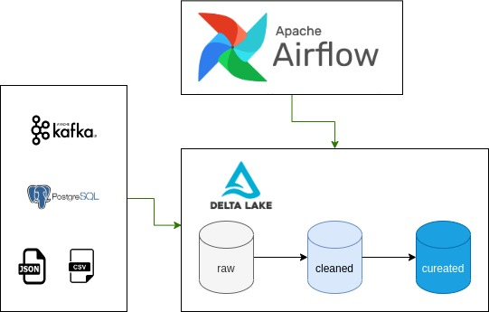

# Custom data pipeline

A data pipeline to process data from various sources. Here we are going to test different types of ingestion (cdc, full load, incremental) and different types of data technologies (airflow, kafka, delta, spark...)

In the main architeture we use three layers (raw, cleaned and curated) to ingest data into a data lake.

## Motivations

Project was based on an interest in Data Engineering field. It provided a good way to develop skills and experience in a range of tools (spark, airflow, docker, delta).

## Architeture



## Setup

For this project you have to had docker installed in your machine (https://www.docker.com/)

This project is to be used in your own machine, so you just need to run the follow command

```commandline
./start.sh
```

to shutdown everything, just type

```commandline
./stop.sh
```

## Tools

Access the tools in your browser

Airflow

```commandline
localhost:8080
```

Spark

```commandline
localhost:8081
```

Jupyter (To use jupyter you must get the token provide in his container)

```commandline
localhost:8888
```

Kafdrop

```commandline
localhost:9000
```

## Screenshots


