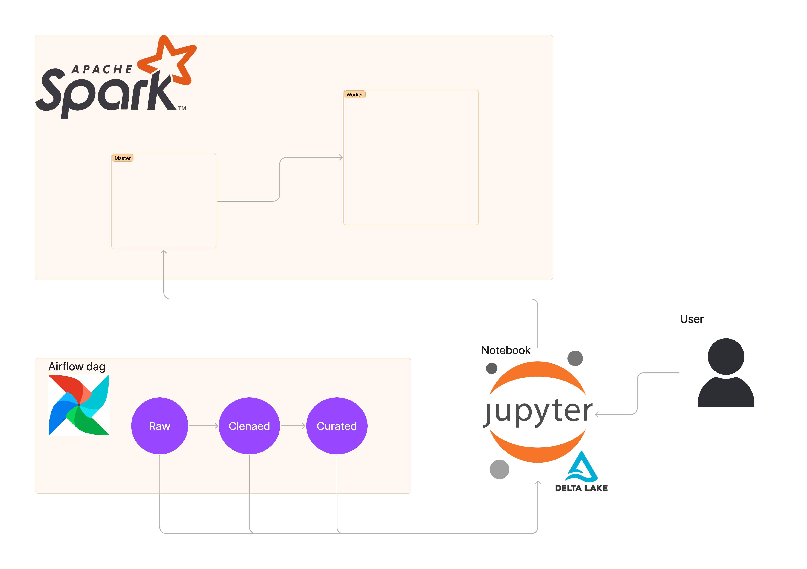
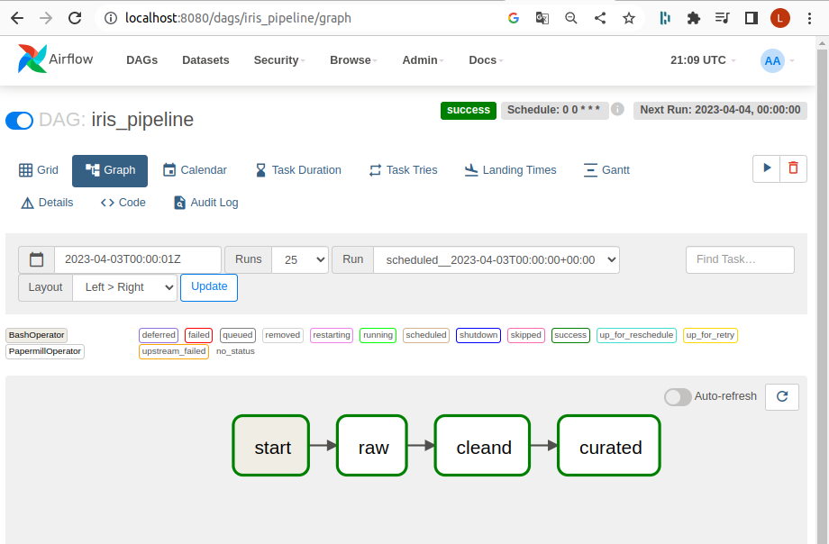
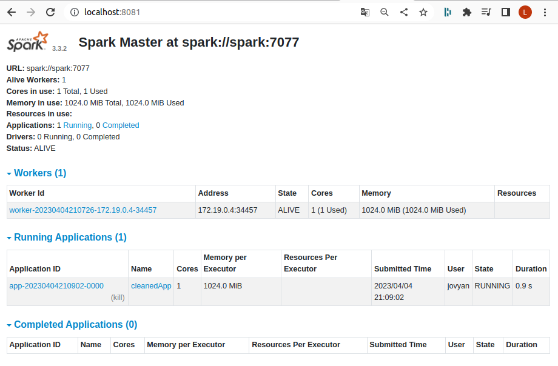
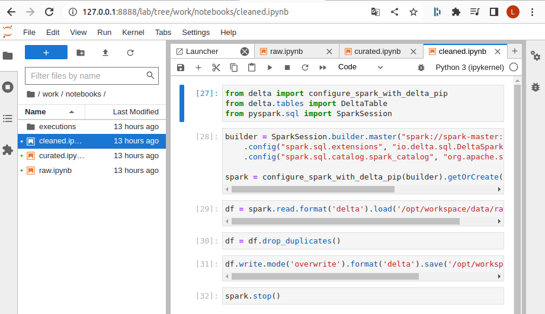

# Custom data pipeline

A data pipeline to process data from various sources (In development)

We use three layers (raw, cleaned and curated) to ingest data into a data lake.

## Motivations

Project was based on an interest in Data Engineering field. It provided a good way to develop skills and experience in a range of tools (spark, airflow, docker, delta).

## Architeture



## Setup

This project is to be used in your own machine, so you just need to run the follow commanda

```commandline
cd docker
docker-compose -f {DOCKER_COMPOSE_FILE.yaml} up -d

```

to shutdown the container 

```commandline
cd docker
docker-compose -f {DOCKER_COMPOSE_FILE.yaml} down
```

## Tools

Access the tools in your browser

Airflow

```commandline
localhost:8080
```

Spark

```commandline
localhost:8081
```

Jupyter (To use jupyter you must get the token provide in his container)

```commandline
localhost:8888
```

## Screenshots







## Register a kafka topic

You need to register a kafka topic using POST request, you can use postman to do it

```commandline
POST  http://localhost:8083/connectors --> To register the kafka connector

{
    "name": "inventory-connector",
    "config": {
        "connector.class": "io.debezium.connector.postgresql.PostgresConnector",
        "database.hostname": "postgres",
        "database.port": "5432",
        "database.user": "postgres",
        "database.password": "postgres",
        "database.dbname" : "postgres",
        "database.server.name": "dbserver1",
        "table.include.list": "inventory.customers"
    }
}  
```

To see the messages you can go to kafdrop on

```commandline
localhost:9000
```